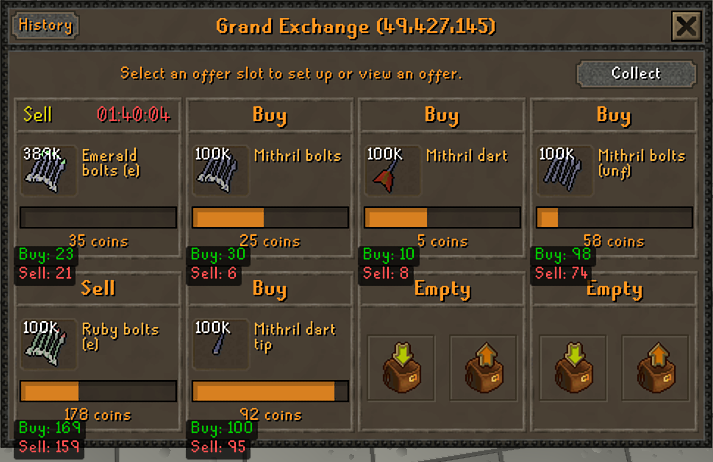
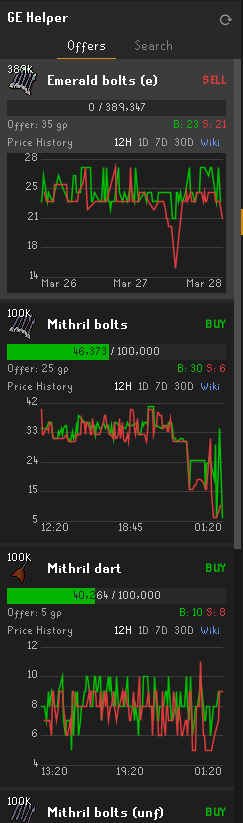

# GE Helper - RuneLite Plugin

A comprehensive Grand Exchange price tracking and monitoring tool for RuneLite, featuring real-time data from the OSRS Wiki Prices API.
## Screenshots

  

  

## Features

- **Live Wiki Prices**: View real-time buy and sell prices directly on the Grand Exchange interface.
- **Improved Overlays**: High-contrast, easy-to-read price information added to your active offers.
- **Search Tab**: A dedicated sidebar tab for searching any item in Old School RuneScape.
- **Autocomplete**: Dynamic item search with autocomplete for fast lookups.
- **Price History**: Interactive graphs showing day high/low trends and historical data.
- **Active Offer Monitoring**: Real-time status updates for your open Grand Exchange slots.

## Installation

Once available on the Plugin Hub, search for **"GE Helper"** and click **Install**.

## License

This project is licensed under the BSD 2-Clause License - see the [LICENSE](LICENSE) file for details.

## Credits

- Data provided by the [OSRS Wiki Price API](https://oldschool.runescape.wiki/w/RuneScape:Real-time_Prices).
- Built for the [RuneLite](https://runelite.net/) client.
