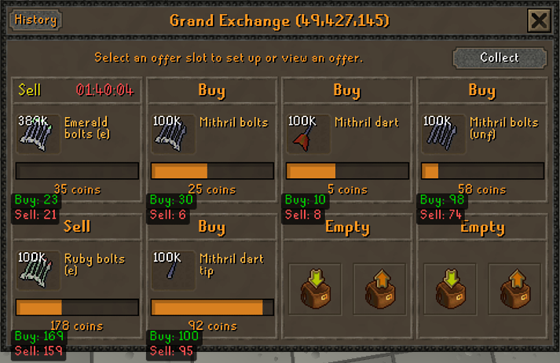
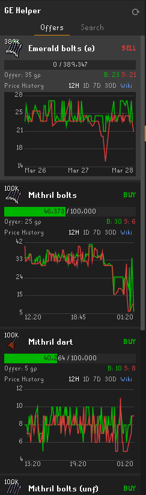

# GE Helper - RuneLite Plugin

A comprehensive Grand Exchange price tracking and monitoring tool for RuneLite, featuring real-time data from the OSRS Wiki Prices API.
## Screenshots

<p align="center">
  
</p>
<p align="center">
  
</p>

## Features

- **Live Wiki Prices**: View real-time buy and sell prices directly on the Grand Exchange interface.
- **Improved Overlays**: High-contrast, easy-to-read price information added to your active offers.
- **Search Tab**: A dedicated sidebar tab for searching any item in Old School RuneScape.
- **Autocomplete**: Dynamic item search with autocomplete for fast lookups.
- **Price History**: Interactive graphs showing day high/low trends and historical data.
- **Active Offer Monitoring**: Real-time status updates for your open Grand Exchange slots.

## Installation

Once available on the Plugin Hub, search for **"GE Helper"** and click **Install**.

## Running it in your installed client (before Plugin Hub)

RuneLite only loads jars from `~/.runelite/sideloaded-plugins` when the client is in
developer mode, and the stock launcher deliberately disables developer mode no matter
what you put in its settings. `Launch-RuneLiteDev.ps1` — kept next to your plugin
checkouts rather than inside any one of them, since it refreshes the jar of every
plugin project beside it — starts the same installed
client through the launcher's `--classpath` entry point, which is the one path that
leaves developer mode enabled. It still updates itself from RuneLite's `bootstrap.json`,
still reads your launcher settings, and still loads your Plugin Hub plugins. It starts the
client as `RuneLite.exe`, so anything that keys off the executable — Logitech G HUB
profiles, per-application settings — keeps matching.

Build and install the plugin jar:

```bash
./gradlew installSideload
```

Then launch:

```bash
powershell -ExecutionPolicy Bypass -File ../Launch-RuneLiteDev.ps1
```

To use it as your Steam shortcut, edit the shortcut's properties:

| Field | Value |
| --- | --- |
| Target | `C:\Windows\System32\WindowsPowerShell\v1.0\powershell.exe` |
| Start In | `C:\Users\<you>\Desktop\custom_plugins\` |
| Launch Options | `-NoProfile -ExecutionPolicy Bypass -WindowStyle Hidden -File "C:\Users\<you>\Desktop\custom_plugins\Launch-RuneLiteDev.ps1"` |

The script waits for the client to exit, so Steam tracks the session normally. If
anything fails — no network, a bad download — it falls back to launching `RuneLite.exe`
the usual way, so you can always get into the game.

Note that Steam Input only applies to a process Steam launched, so if you want your Steam
controller layout you have to start the game from Steam rather than running the script
from a terminal. Logitech G HUB bindings work either way, since those match on the
executable path.

Developer mode also loads RuneLite's built-in Developer Tools plugin, which cannot start
against the launcher's stripped API jar. It logs an error at startup and is otherwise
harmless.


## License

This project is licensed under the BSD 2-Clause License - see the [LICENSE](LICENSE) file for details.

## Credits

- Data provided by the [OSRS Wiki Price API](https://oldschool.runescape.wiki/w/RuneScape:Real-time_Prices).
- Built for the [RuneLite](https://runelite.net/) client.
